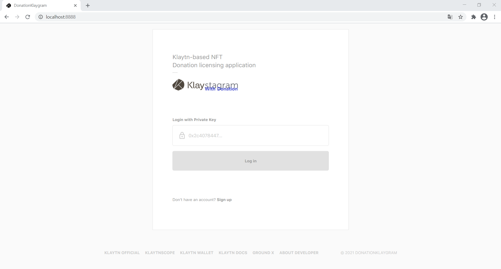
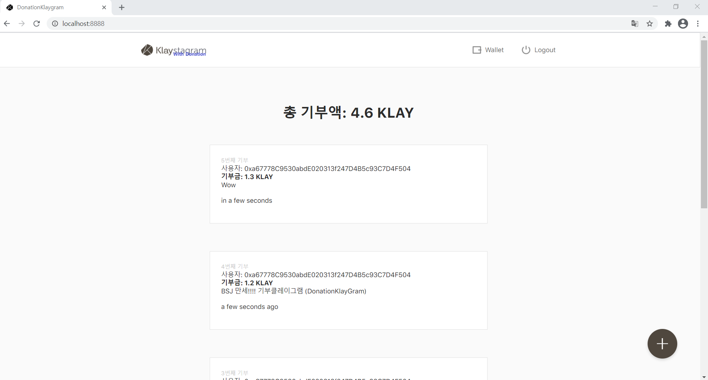

# DonationKlayGram Project: 기부클레이그램

### Table of contents
- [1) Introduction](#1-introduction)
- [2) Getting started](#2-getting-started)
- [3) npm package information](#3-npm-package-information)
- [4) Directory Structure](#4-directory-structure)
- [5) Web browser support scope](#5-web-browser-support-scope)
- [6) License](#6-license)

### 1) Introduction
<p align="center"></p>  
<p align="center"></p>  

DonationKlayGram is a practical BApp examples with complete source code and explanation. You can see `DonationKlayGram`, a Klaytn-based NFT donation licensing application.

> What I referenced can be found in [Klaytn Docs_Klaystagram](https://docs.klaytn.com/bapp/tutorials/klaystagram)

### 2) Getting started
1. Open terminal
2. Clone the repo by running `git clone https://github.com/SharkBSJ/DonationKlayGram.git`
3. Run `npm install`to install node packages
4. Run `npm run local`
5. App should be running in https://localhost:8888
```
<Environment>
$ node --version
$ v10.16.0
$ truffle version
$ Tryffle v5.0.27 (must be higher than version 5)

<Deploy Contract>
$ truffle deploy --network baobab
```

### 3) npm package information
> dependencies
```
The DonationKlayGram project is optimized for caver-js version "1.1.2".
caver-js needs confirmation before updating.
```

### 4) Directory Structure
> Folder structure
```
webpack.base.js         // Base webpack settings
webpack.dev.js          // Settings for local development
webpack.prod.js         // Settings for build. (note: NODE_ENV= must be set to production)

dist                    // Files built with 'npm run build'
static                  // Contains static resources (index.html, images, font files etc...)

1. src
src - pages             // React page components (or containers)
src - components        // React components
src - constants         // Constants used throughout the project
src - klaytn            // Klaytn related definition folder
src - redux             // Redux settings (reducers, actions, store.js)
src - styles            // Style util files. Contains color, size, font info and etc. as well as Sass at-rules
src - utils             // Miscellaneous helper functions used throughout the source code
index.js                // Project build entry point.
index.scss              // .scss file for index.js mentioned above.
```

### 5) Web browser support scope
> Supported browsers.

Chrome | Safari | Firefox | IE Edge*
---------------------- | ---------------------- | ---------------------- | ----------------------
Supported (Optimized) | Supported | Supported | Not supported

### 6) License
Klaystagram is released under the [MIT license](./LICENSE).

```
MIT License

Copyright (c) 2018 Klaystagram Authors

Permission is hereby granted, free of charge, to any person obtaining a copy
of this software and associated documentation files (the "Software"), to deal
in the Software without restriction, including without limitation the rights
to use, copy, modify, merge, publish, distribute, sublicense, and/or sell
copies of the Software, and to permit persons to whom the Software is
furnished to do so, subject to the following conditions:

The above copyright notice and this permission notice shall be included in
all copies or substantial portions of the Software.

THE SOFTWARE IS PROVIDED "AS IS", WITHOUT WARRANTY OF ANY KIND, EXPRESS OR
IMPLIED, INCLUDING BUT NOT LIMITED TO THE WARRANTIES OF MERCHANTABILITY,
FITNESS FOR A PARTICULAR PURPOSE AND NONINFRINGEMENT. IN NO EVENT SHALL THE
AUTHORS OR COPYRIGHT HOLDERS BE LIABLE FOR ANY CLAIM, DAMAGES OR OTHER
LIABILITY, WHETHER IN AN ACTION OF CONTRACT, TORT OR OTHERWISE, ARISING FROM,
OUT OF OR IN CONNECTION WITH THE SOFTWARE OR THE USE OR OTHER DEALINGS IN
THE SOFTWARE.
```